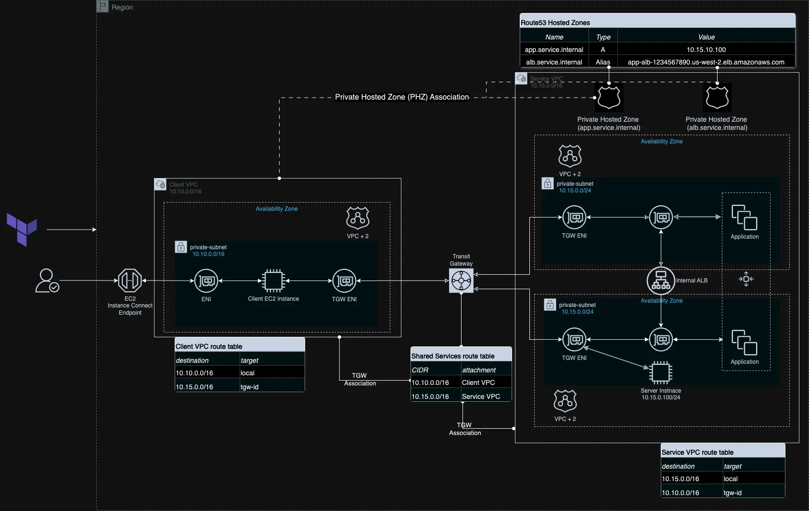

# Using Terraform to build Route53 Private Hosted Zone (PHZ) across VPCs
This project demonstrates how to use Terraform to build an Amazon Route53 Private Hosted Zone (PHZ) and share accross VPCs in the same AWS Region and AWS account.

## Prerequisites
Before you begin, ensure you have the following:

- 2 AWS accounts
- Terraform installed locally
- AWS CLI installed and configured with appropriate access credentials profiles for the 2 AWS accounts

## Architecture


---

## Project Structure
```bash
|- A_Record/
   |- diagrams/
   |- provider.tf
   |- local.tf
   |- vpc.tf
   |- output.tf
   |- route53.tf
   |- tgw.tf
   |- variables.tf
   |- terraform.tfvars
   |- ec2.tf
   |- security-groups.tf
   |- webserver.sh

```
---
## Getting Started

Clone this repository:

   ```bash
   git clone https://github.com/FonNkwenti/tf-route53-phz-cross-vpc.git
   ```


### Set up the PrivateLink Endpoint Service in the Service Producer's account
1. Navigate to the project directory:
   ```bash
   cd tf-route53-phz-cross-vpc/A_Record/
   ```
2. Initialize Terraform:
   ```bash
   terraform init
   ```
3. Review and modify `variables.tf` if required
4. Create a `terraform.tfvars` file in the root directory and pass in values for the variables.
   ```bash
      main_region              = "eu-west-1"
      account_id               = 123456789123
      environment              = "dev"
      project_name             = "tf-route53-phz-cross-vpc"
      service_name             = "services.internal"
      cost_center              = "237"
      ssh_key_pair             = <name_of_your_ec2_key_pair>
   ```
5. Apply the Terraform configure:
   ```bash
   terraform apply --auto-approve
   ```
6. Your will have the following outputs: 
   ```bash
   Apply complete! Resources: 27 added, 0 changed, 0 destroyed.

   Outputs:
   client_instance_private_ip = "10.10.10.84"
   connect_to_client_instance = "aws ec2-instance-connect ssh --instance-id i-04edc0836b71d48e6 --os-user ec2-user --connection-type eice --region eu-west-1"
   my_app_dns_name = "app.services.internal"
   services_instance_private_dns = "ip-10-15-10-100.eu-west-1.compute.internal"
   services_instance_private_ip = "10.15.10.100"

   ```
7.   


## Testing
1. Connect to the EC2 instance using the EC2 Instance connect Terraform output command from the Terraform output
   ```bash

   aws ec2-instance-connect ssh --instance-id i-04edc0836b71d48e6 --os-user ec2-user --connection-type eice --region eu-west-1

   ```
2. Test IP connectivity to the EC2-based service instance's private IP address copied from the Terraform output.
   ```bash
      ping 10.15.0.100
   ```
3. Test DNS resolution of the custom DNS name for the EC2-based instance
   1. Using Ping
      ```bash
      ping app.services.internal"
      ```


   2. Using nslookup
      ```bash
      nslookup app.services.internal"
      ```

   3. Using CURL
   ```bash
   curl http://app.services.internal
      <html>
      <head>
         <title>Instance Information</title>
      </head>
      <body>
         <h1>Instance Information</h1>
         <p><strong>Instance Name:</strong> i-0cbd519ffe7583c5d</p>
         <p><strong>Private IP:</strong> 10.255.10.40</p>
         <p><strong>Public IP:</strong> No public IP assigned</p>
         <p><strong>Availability Zone:</strong> eu-west-1a</p>
         <p><strong>Region:</strong> eu-west-1</p>
      </body>
      </html>
   ```

## Clean up

### Remove all resources created by Terraform
1. Navigate to the  `A_Record` directory:
   ```bash
   cd  tf-route53-phz-cross-vpc/A_Record/
   ```
2. Destroy all Terraform resources:
   ```bash
   terraform destroy --auto-apply
   ```
---


<!-- ## Step-by-step Turial -->


## License

This project is licensed under the MIT License - see the `LICENSE` file for details.
