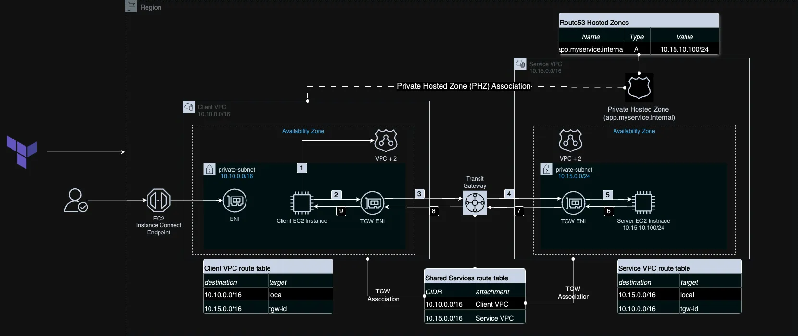

# Using Terraform to build Route53 Private Hosted Zone (PHZ) across VPCs

This project demonstrates how to use Terraform to build an Amazon Route53 Private Hosted Zone (PHZ) and share across VPCs in the same AWS Region and AWS account.

## Prerequisites

Before you begin, ensure you have the following:

- AWS account
- Terraform installed locally
- AWS CLI installed

## Architecture



---

## Project Structure

```bash
|- A_Record/
   |- provider.tf
   |- local.tf
   |- vpc.tf
   |- output.tf
   |- route53.tf
   |- tgw.tf
   |- variables.tf
   |- terraform.tfvars
   |- ec2.tf
   |- security-groups.tf
   |- webserver.sh

```

---

## Getting Started

1. Clone this repository:

   ```bash
   git clone https://github.com/FonNkwenti/tf-route53-phz-cross-vpc.git
   ```

2. Navigate to the project directory:

   ```bash

   cd tf-route53-phz-cross-vpc/A_record/
   ```

3. Initialize Terraform:

   ```bash
   terraform init
   ```

4. Review and modify the variables in `variables.tf` if required
5. Create a `terraform.tfvars` file in the root directory and pass in values for the following variables;

   ```bash
      main_region              = "eu-west-1"
      account_id               = 123456789123
      environment              = "dev"
      project_name             = "tf-route53-phz-cross-vpc"
      service_name             = "services.internal"
      cost_center              = "237"
      ssh_key_pair             = <name_of_your_ec2_key_pair>
   ```

6. Apply the Terraform configuration:

   ```bash
   terraform apply --auto-approve
   ```

7. Your will have the following outputs: 

   ```bash
   Apply complete! Resources: 27 added, 0 changed, 0 destroyed.

   Outputs:
   client_instance_private_ip = "10.10.10.84"
   connect_to_client_instance = "aws ec2-instance-connect ssh --instance-id i-04edc0836b71d48e6 --os-user ec2-user --connection-type eice --region eu-west-1"
   my_app_dns_name = "app.myservices.internal"
   services_instance_private_dns = "ip-10-15-10-100.eu-west-1.compute.internal"
   services_instance_private_ip = "10.15.10.100"

   ```  

## Testing

1. Connect to the EC2 instance using the EC2 Instance connect Terraform output command from the Terraform output

   ```bash

   [ec2-user@ip-10-10-10-153 ~]$ aws ec2-instance-connect ssh --instance-id i-04edc0836b71d48e6 --os-user ec2-user --connection-type eice --region eu-west-1

   ```

2. Test IP connectivity to the EC2-based service instance's private IP address copied from the Terraform output.

   ```bash
      [ec2-user@ip-10-10-10-153 ~]$ ping 10.15.0.100
   ```

3. Test DNS resolution of the custom DNS name for the EC2-based instance
   1. Using Ping

      ```bash
       [ec2-user@ip-10-10-10-153 ~]$ ping app.myservices.internal
      ```

   2. Using nslookup

      ```bash
      [ec2-user@ip-10-10-10-153 ~]$ nslookup app.myservices.internal
      ```

   3. Using CURL

      ```bash
      [ec2-user@ip-10-10-10-153 ~]$ curl http://app.myservices.internal
      ```

## Clean up

### Remove all resources created by Terraform

1. Navigate to the  `A_record` directory:

   ```bash
   [ec2-user@ip-10-10-10-153 ~]$ cd tf-route53-phz-cross-vpc/A_record/
   ```

2. Destroy all Terraform resources:

   ```bash
   [ec2-user@ip-10-10-10-153 ~]$ terraform destroy --auto-approve
   ```

---


<!-- ## Step-by-step Turial -->

## License

This project is licensed under the MIT License - see the `LICENSE` file for details.

## Requirements

| Name | Version |
|------|---------|
| terraform | >= 1.0.0 |
| aws | >= 4.0.0 |

## Providers

| Name | Version |
|------|---------|
| aws | n/a |

## Modules

| Name | Source | Version |
|------|--------|---------|
| [client_vpc](https://github.com/terraform-aws-modules/terraform-aws-vpc) | terraform-aws-modules/vpc/aws | n/a |
| [services_vpc](https://github.com/terraform-aws-modules/terraform-aws-vpc) | terraform-aws-modules/vpc/aws | n/a |
| [client_instance_security_group](https://github.com/terraform-aws-modules/terraform-aws-security-group) |terraform-aws-modules/security-group/aws |  n/a |
| [client_instance_connect_security_group](https://github.com/terraform-aws-modules/terraform-aws-security-group) |terraform-aws-modules/security-group/aws | n/a |
| [client_instance](https://github.com/terraform-aws-modules/terraform-aws-ec2-instance) | terraform-aws-modules/ec2-instance/aws | n/a |

## Resources

| Name | Type |
|------|------|
| [aws_route53_zone_association.client_vpc_association](https://registry.terraform.io/providers/hashicorp/aws/latest/docs/resources/route53_zone_association) | resource |
| [aws_route53_zone_association.services_vpc_association](https://registry.terraform.io/providers/hashicorp/aws/latest/docs/resources/route53_zone_association) | resource |
| [aws_route53_record.instanca_a](https://registry.terraform.io/providers/hashicorp/aws/latest/docs/resources/route53_record) | resource |
| [aws_ec2_transit_gateway.main_tgw](https://registry.terraform.io/providers/hashicorp/aws/latest/docs/resources/ec2_transit_gateway) | resource |
| [aws_ec2_transit_gateway_route_table.services_rt](https://registry.terraform.io/providers/hashicorp/aws/latest/docs/resources/ec2_transit_gateway_route_table) | resource |
| [aws_route53_zone.phz](https://registry.terraform.io/providers/hashicorp/aws/latest/docs/resources/route53_zone) | resource |
| [aws_ec2_instance_connect_endpoint.client_instance](https://registry.terraform.io/providers/hashicorp/aws/latest/docs/resources/ec2_instance_connect_endpoint) | resource |

## Data Sources

| Name | Type |
|------|------|
| [aws_caller_identity.main](https://registry.terraform.io/providers/hashicorp/aws/latest/docs/data-sources/caller_identity) | data source |
| [aws_ami.amazon_linux_2](https://registry.terraform.io/providers/hashicorp/aws/latest/docs/data-sources/ami) | data source |
| [aws_availability_zones.available](https://registry.terraform.io/providers/hashicorp/aws/latest/docs/data-sources/availability_zones) | data source |

## Inputs

| Name | Description | Type | Default | Required |
|------|-------------|------|---------|:--------:|
| main_region | AWS Region to deploy resources | string | "eu-west-1" | yes |
| account_id | AWS Account ID | string | n/a | yes |
| environment | Environment name | string | "dev" | yes |
| project_name | Name of the project | string | "tf-project-name" | yes |
| service_name | Name of the service | string | "services.internal" | yes |
| cost_center | Cost center identifier | string | "237" | yes |
| ssh_key_pair | Name of the SSH key pair | string | n/a | yes |
| service_ami | AMI ID for the EC2 instances | string | n/a | yes |

## Outputs

| Name | Description |
|------|-------------|
| services_instance_private_ip | Private IP of the services instance |
| client_instance_private_ip | Private IP of the client instance |
| connect_to_client_instance | Connection string for the client instance |
| services_instance_private_dns | Private DNS of the services instance |
| instance_a_fqdn | FQDN of the A record created |
