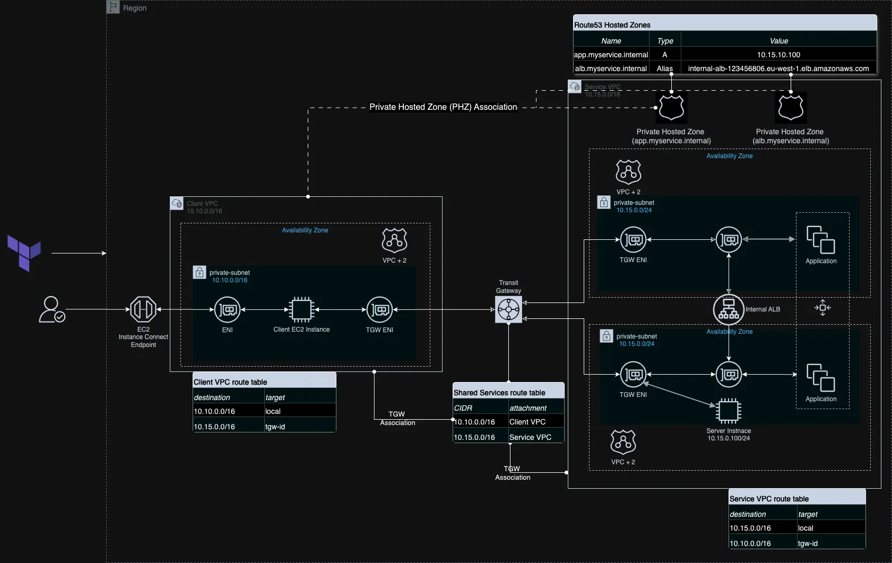

# Using Terraform to build Route53 Private Hosted Zone across VPCs
This project demonstrates how to use Terraform to build an Amazon Route53 Private Hosted Zone (PHZ) and share with VPCs in the same AWS Region for the same AWS account.

## Architecture

---

## Project Structure

There are 2 directories, one for Route53 DNS A Record scenario and another for Route53 Alias record scenario.

1. To deploy the scenario for Route53 A Record, go into the A_record folder and follow the instructions in the README.md file

<!-- ## Step-by-step Tutorial -->

## License

This project is licensed under the MIT License - see the `LICENSE` file for details.
