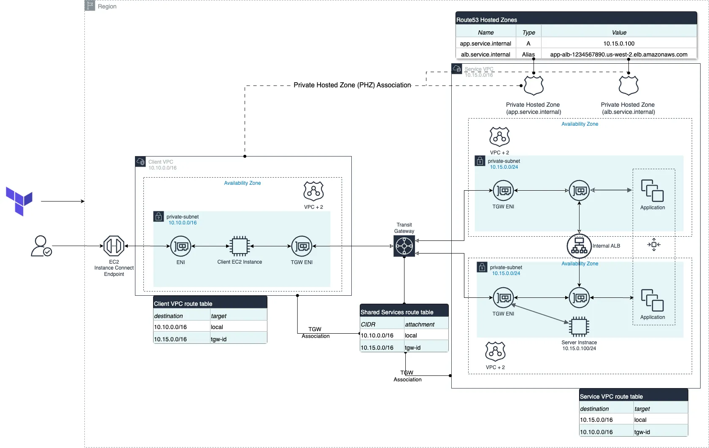

# Using Terraform to build Route53 Private Hosted Zone across VPCs
This project demonstrates how to create a Private Hosted Zone in Amazon Route 53 and share it across multiple VPCs. The primary goal is to enable DNS resolution for resources in one VPC from another VPC using private DNS names

## Architecture



## Project Structure

The project is organized into different directories, each representing a specific use case for DNS record types:

- `A_record/`: Contains the implementation for Amazon Route 53 "A" record use case.
- `Alias_record/`: Contains the implementation for Amazon Route 53 "Alias" record use case.
- `CNAME_record/`: (Planned) Will contain the implementation for DNS CNAME record use case.

## Key Components

1. VPC Setup:
   - Services VPC: The main VPC where resources are hosted
   - Client VPC: A separate VPC from which resources in the Services VPC need to be accessed

2. Transit Gateway:
   - Facilitates network connectivity between the Services VPC and Client VPC

3. Route 53 Private Hosted Zone:
   - Created in the Services VPC
   - Shared with the Client VPC

4. DNS Records:
   - Various record types (A, Alias, CNAME) demonstrating different DNS resolution scenarios

## Prerequisites

- AWS CLI configured with appropriate permissions
- Terraform installed (version specified in `terraform.tf`)

## Usage

1. Clone this repository
2. Navigate to the desired use case directory (e.g., `A_record/`)
3. Initialize Terraform:
    ```bash
    terraform init
    ```
4. Review and modify the `terraform.tfvars` file as needed
5. Plan and apply the Terraform configuration:
    ```bash
    terraform Plan
    terraform apply
    ```

## Key Features

- Creates two VPCs (Services and Client) with necessary subnets and routing
- Sets up a Transit Gateway for inter-VPC communication
- Establishes a Private Hosted Zone in Route 53
- Associates the Private Hosted Zone with both VPCs
- Demonstrates DNS resolution across VPCs using private DNS names

## Notes

- Ensure that DNS hostnames and DNS support are enabled in both VPCs
- The project uses Terraform modules for VPC creation and management
- Security groups and network ACLs are managed separately for flexibility

## Contributing

Contributions to expand on different DNS record type use cases or improve existing implementations are welcome. Please submit a pull request with your proposed changes.


<!-- ## Step-by-step Tutorial -->


## License

This project is licensed under the MIT License - see the `LICENSE` file for details.
